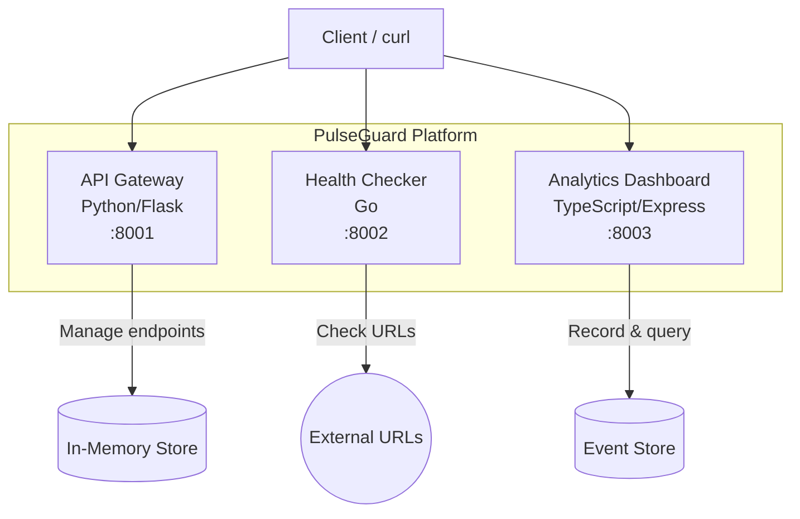

# PulseGuard

A multi-service health monitoring platform that checks endpoint availability in real-time, records check results, and provides analytics and uptime statistics.

## Architecture



## Services

| Service | Language | Port | Description |
|---------|----------|------|-------------|
| **API Gateway** | Python (Flask) | 8001 | Manages monitored endpoint registrations (CRUD) |
| **Health Checker** | Go | 8002 | Performs HTTP health checks against URLs (single & batch) |
| **Analytics Dashboard** | TypeScript (Express) | 8003 | Records check events and provides uptime/response-time statistics |

## Quick Start

### Prerequisites

- Docker & Docker Compose
- (For local development) Python 3.12+, Go 1.22+, Node.js 20+

### Run with Docker Compose

```bash
cp .env.example .env    # optional: customize ports
make up                 # build and start all services
make health             # check health of all services
make down               # stop all services
```

### Run Tests

```bash
make test               # run all tests (Python + Go + TypeScript)
make lint               # run all linters
```

## API Reference

### API Gateway (`:8001`)

| Method | Endpoint | Description |
|--------|----------|-------------|
| `GET` | `/health` | Health check |
| `GET` | `/api/v1/endpoints` | List all monitored endpoints |
| `POST` | `/api/v1/endpoints` | Register a new endpoint |
| `GET` | `/api/v1/endpoints/:id` | Get endpoint details |
| `DELETE` | `/api/v1/endpoints/:id` | Remove an endpoint |
| `PUT` | `/api/v1/endpoints/:id/status` | Update endpoint status |

**Create endpoint:**
```bash
curl -X POST http://localhost:8001/api/v1/endpoints \
  -H "Content-Type: application/json" \
  -d '{"url": "https://example.com", "name": "Example", "interval_seconds": 30}'
```

### Health Checker (`:8002`)

| Method | Endpoint | Description |
|--------|----------|-------------|
| `GET` | `/health` | Health check |
| `POST` | `/api/v1/check` | Check a single URL |
| `POST` | `/api/v1/check/batch` | Check multiple URLs concurrently |

**Single check:**
```bash
curl -X POST http://localhost:8002/api/v1/check \
  -H "Content-Type: application/json" \
  -d '{"url": "https://example.com", "timeout_seconds": 5}'
```

**Batch check:**
```bash
curl -X POST http://localhost:8002/api/v1/check/batch \
  -H "Content-Type: application/json" \
  -d '[{"url": "https://example.com"}, {"url": "https://github.com"}]'
```

### Analytics Dashboard (`:8003`)

| Method | Endpoint | Description |
|--------|----------|-------------|
| `GET` | `/health` | Health check |
| `POST` | `/api/v1/events` | Record a check event |
| `GET` | `/api/v1/events?limit=50` | List recent events |
| `GET` | `/api/v1/stats?url=...` | Get uptime & response time stats |
| `DELETE` | `/api/v1/events` | Clear all events |

**Record event:**
```bash
curl -X POST http://localhost:8003/api/v1/events \
  -H "Content-Type: application/json" \
  -d '{"endpointUrl": "https://example.com", "status": "healthy", "statusCode": 200, "responseTimeMs": 42}'
```

**Get stats:**
```bash
curl http://localhost:8003/api/v1/stats?url=https://example.com
```

## Environment Variables

| Variable | Default | Description |
|----------|---------|-------------|
| `API_PORT` | `8001` | API Gateway port |
| `LOG_LEVEL` | `INFO` | API Gateway log level |
| `FLASK_DEBUG` | `false` | Flask debug mode |
| `CHECKER_PORT` | `8002` | Health Checker port |
| `DASHBOARD_PORT` | `8003` | Analytics Dashboard port |

## Project Structure

```
pulseguard-io/
├── docker-compose.yml
├── Makefile
├── .env.example
├── .gitignore
├── .github/workflows/ci.yml
├── README.md
└── services/
    ├── api-gateway/          # Python / Flask
    │   ├── app.py
    │   ├── test_app.py
    │   ├── requirements.txt
    │   └── Dockerfile
    ├── health-checker/       # Go
    │   ├── main.go
    │   ├── main_test.go
    │   ├── go.mod
    │   └── Dockerfile
    └── analytics-dashboard/  # TypeScript / Express
        ├── src/
        │   ├── app.ts
        │   ├── app.test.ts
        │   └── index.ts
        ├── package.json
        ├── tsconfig.json
        ├── jest.config.js
        └── Dockerfile
```

## CI/CD

GitHub Actions workflow (`.github/workflows/ci.yml`) runs on every push and PR to `main`:

1. **test-python** - Lint with flake8, run pytest
2. **test-go** - Run go vet, run go test
3. **test-typescript** - Lint with ESLint, run Jest
4. **docker-build** - Build all Docker images (after tests pass)

> **Note:** Due to GitHub API limitations, the `.github/workflows/ci.yml` file may need to be added manually after the initial repository setup. The file content is included in this repository.

## License

MIT
